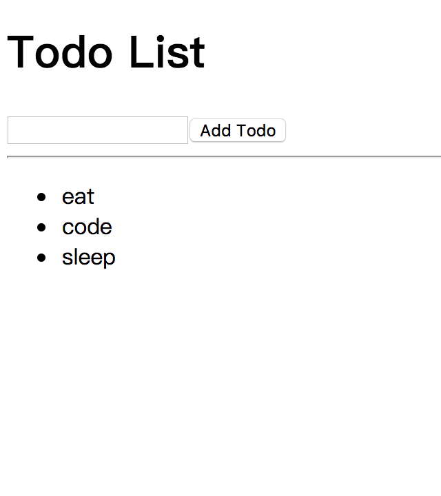

# Hello World

一个简单的 React Todo List demo，通过引入基本库，实现在浏览器端将 JSX 语法转换成 JS 语法，并执行。
预览效果，直接双击打开 index.html 即可。

## 预览效果



## 代码解析

```html
<!-- React 的核心库 -->
<script src="./js/react.min.js"></script>
<!-- 提供与 DOM 相关的功能 -->
<script src="./js/react-dom.min.js"></script>
<!-- Babel 转码 -->
<script src="./js/babel.min.js"></script>
```

[代码](./index.html)

以上三个库的功能在此就不赘述了，我们主要看示例代码。首选代码写在了 `<script type="text/babel"></script>` 
里面而不是通过 `<script type="text/babel" src="./demo.jsx">` 引入是因为示例代码考虑的场景是直接在本地
浏览器内打开，而通过 `src` 引入 `type="text/babel"` 的代码会首选由 babel 负责转码，此时 babel 需要去读
取 `src` 的引入 (实际上是本地文件) 这是违反 JavaScript 的限制的，因此大家只会在 Console 看到一个错误警告
而在页面看不到任何东西。

在示例代码中，我们使用标准的 ES6 class 的写法 `class TodoList extends React.Component {}` ，去声明 
React 组件，这也将是这个项目中主要使用的方式，当然也会有部分 stateless functional component 的无状态纯
函数组件，两者的区别会在后面的章节进行讨论。

在构造函数 `constructor` 中，我们对两个方法 `handleChange` 和 `addTodo` 绑定了 `this` 上下文，关于是
否需要绑定上下文，个人的观点是只要方法中有使用 `this` 就是需要指明的，而将这个动作放在 `constructor` 中使
其只执行一次，避免了每次在 `render` 的时候都去重新绑定，这样做的目的主要是从性能上考虑 (`bind` 方法每次都
生成了一个新的函数) ，具体的原因也会在后面的章节讨论。

`handleChange` 作为 `onChange` 事件传递给了这个组件里面唯一的 `input` 元素，这里的 `input` 因为指定了 
`value={this.state.text}` 使其成为了一个 "受控组件" ，换言之，必须有 `setState` 去改变组件的 state 才
会让 `input` 的 `value` 改变。这个可能是很多初接触 React 或者一些资深的前端开发人员很不习惯的地方，但是通过
受控组件的引入，使得页面数据变的可控，也很好的贯彻了 React 的理念 "single source of truth" 。就示例的代码
来看，在任意时刻只要 state 一定 (示例中没有 props) ，页面永远是一致的。也由此我们有了一个清晰的单向绑定，
即数据由 state 流向 DOM ；而同时，由于 `onChange` 事件我们又实现了去主动的更新 state ，从而实现了所谓的
双向绑定。

在 `addTodo` 方法中，我们使用了 `[...this.state.todos]` 的解构表达式，重新生成了一组 `todos` 而避免了
直接操作原 state ，这一方面是顺应 React 的哲学，元素是不可变的 (immutable) ，另一方面也减少了可能的副作用
产生 (纯函数的规则) 。 (这个说法实际上是比较牵强的， JavaScript 作为一项弱语言是不能限制你的任何操作的，你
依旧可以直接对 state 赋值然后去 `setState`，就这个示例来讲在页面上是看不出来差别的，所以我也不知道该怎么去
解释这种反模式，~~尴尬~~) 。

## 拓展阅读

下一章: [Node.js 及 npm 简单介绍](../lesson102/README.md)
