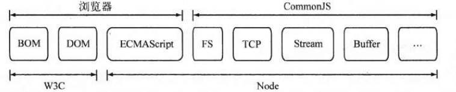

# Node.js 及 npm 简单介绍

如果你是从上一章过来的，我想多半都会有个疑问，lesson 101 中引入的 js 库都是哪里来的？当然你可以去官方下载或
是引用 CDN 但这两种方法都需要你去找。目前前端发展速度飞快，各种库、包多如牛毛，显然作为一名开发人员离不开一个
好的包管理工具 Package Manager ，这里的话会简单介绍使用 npm 。至于 Node.js 是什么鬼，这里不想展开，参考
下面这张图吧。



## 安装

npm 可以单独安装，也可以和 Node.js 一起安装，考虑到我们后面也会使用 Node.js 所以建议大家直接安装 Node.js 
(目前最新版是 8.4.0，笔者安装的版本是 7.8.0) 。可以从 [Node.js 官网](https://nodejs.org/) 下载对应
平台的安装程序，在 Windows 上安装时记得选择全部组件，并勾选 `Add to Path` 。安装完成后在控制台输入 
`node -v` 和 `npm -v` 如果能看到对应版本号，即表示安装成功。

考虑到 Node 的官方模块仓库网速太慢，推荐切换到阿里的源。

```bash
$ npm config set registry https://registry.npm.taobao.org/
```

执行 `npm config get config` 可以查看是否切换成功。

## 使用

最简单的用法就是直接 `npm install [lib_name]` 会安装对应的库在当前文件夹下的 `./node_modules` 目录下，
既然说了 npm 是包管理工具，这样用显然起不到管理的作用，所以更多的用法是下面这样的:

```bash
# 初始化一个 package.json 文件
# 用来存放项目的描述及所依赖的库等信息
$ npm init
# 安装 react react-dom babel-standalone 三个库
# 并将依赖及版本信息保存至 package.json 中
$ npm install --save react react-dom babel-standalone
```

经过以上两步在当前文件夹生成的 package.json 大概长这样:

```json
{
  "name": "lesson102",
  "version": "1.0.0",
  "description": "",
  "main": "index.js",
  "scripts": {
    "test": "echo \"Error: no test specified\" && exit 1"
  },
  "author": "Rainsho",
  "license": "ISC",
  "dependencies": {
    "babel-standalone": "^6.26.0",
    "react": "^15.6.1",
    "react-dom": "^15.6.1"
  }
}
```

可以看到三个库及当前版本已经加入到了 `dependencies` 中，这时候直接在当前目录下执行 `npm install` 就会安装 
`dependencies` 里面所有的依赖或者说库了。当然，我们还可以看到所有的版本号前面都是 `^` 开头的，这表示会下载最新
版本的库，如果需要固化版本的话可以把 `^` 删掉，或者使用 `npm shrinkwrap` 创建一个当前版本的快照，此时会生成一个 
npm-shrinkwrap.json 文件，如果该文件存在，则在 `npm install` 时会优选取里面指定的版本。当然你也可以选择性的
安装某个版本的库，如这样 `npm install react@15.6.1` 。

package.json 中还有一处值得关注的就是 `scripts` 的配置了，执行 `npm run [command]` 就会执行对应的脚本，当然
这是在 Node.js 的环境下执行，后面会介绍。

## 示例

OK，现在我们执行 `npm install` 然后把 lesson 101 中依赖的库指向 `./node_modules` 目录下对应的 js 文件，打开 
index.html 就可以看到之前的内容了。

```html
<!-- 这里把引用从压缩版 .min.js 换成了开发版 .js 这样在 Console 可以看到更多提示信息 -->
<script src="./node_modules/react/dist/react.js"></script>
<script src="./node_modules/react-dom/dist/react-dom.js"></script>
<script src="./node_modules/babel-standalone/babel.js"></script>
```

## 扩展阅读

1. [Node.js 安装配置](http://www.runoob.com/nodejs/nodejs-install-setup.html)

下一章: [Babel 及 webpack 打包](../lesson103/README.md)
