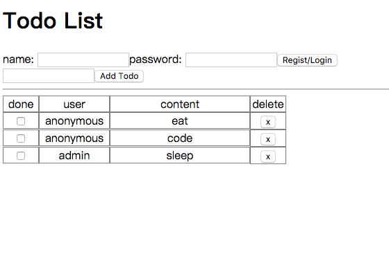

# Todo List v2.0

我们在上一章已经配置好了一个比较完整的开发环境了，后面的开发我们都可以直接使用上一章的示例中的 .babelrc 
.eslintrc package.json webpack.config.js 等文件中的相关配置，根据需要添加或修改即可 (说白了，把这些文
件拿过来，`npm install` 一下环境就搭好了) 。当然，网上也有很多类似的脚手架工具，其中开发 React 最方便的脚
手架莫过于官方的 [create-react-app](https://github.com/facebookincubator/create-react-app) 工具
了，基本上可以一键搭建好一个现成的 React 开发环境。其配置的内容和方便程度也是远胜与之前章节提到的 (其实前面
章节都是在熟悉和使用脚手架里面用到的一些工具) 。

在引言里我们提到要实现一个多人共享的开发的 Todo List 应用，现在就让我们开始完善我们的代码。在这一章里我们还是
使用原生的两个库，然后尝试按官方文档里 `thinking-in-react` 的思路来设计我们的应用。

## thinking-in-react

1. 画模型图

~~作为一个程序猿直男，你让我画模型图？算了吧，放弃这一步，等以后找个美工女盆友再说吧 (***伪命题***) 。~~

既然不画模型图，这里就头脑风暴一下我们的数据结构怎么设计吧，其实这也可以是一个设计的入口。我们要做一个多人共享的 
Todo List 应用，所以至少我们应该有两部分数据: 1)用户，姑且叫做 `doer` 吧 (个人不喜欢用 `user` 容易和数据库
的关键字冲突)； 2)待办，姑且叫做 `todo` 吧。两个的关联关系应该是 `doer` 1 - N `todo` ，当然如果以后要做多人
协作的 Todo 可能还需是要改成 M - N 的关系，到时候加个中间表吧，这里先不考虑。 `doer` 和 `todo` 在数据库通过
外键关联，在前台我们可以直接将 `doer` 对象赋值在 `todo` 内部，不过为了减少冗余数据，我们暂时将两组数据分开。
这样我们暂定的数据结构如下，接着就可以根据这个结构去 Mock 数据了。

```javascript
// ./src/api/data.js
export const doers = [
  { uid: 0, name: 'anonymous', pswd: '' },
  { uid: 1, name: 'admin', pswd: 'admin' },
];

export const todos = [
  { tid: 0, uid: 0, done: false, content: 'eat' },
  { tid: 1, uid: 0, done: false, content: 'code' },
  { tid: 2, uid: 1, done: false, content: 'sleep' },
];
```

关于数据结构的问题，这里多一句。向上面的数据结构我们看到 `doer` 和 `todo` 是两个集合，这种组织方式对数据库和后端
比较友好，但是在前端使用并不是很方便。由于 `todo` 需要引用 `doer` 所以在前台更常见的 `doer` 的组织方式可能是 
`{[uid]: doer}` 的形式，当然两种结构的转换其实也很简单，这里就不展开了，我们在完善功能的时候再说。

2. 将模型图拆分成组件

由于并没有真的模型图，这一部分我们还是以整理思路为主。结合 1. 中的数据，我们很自然的会想到我们应该有一个主组件 
(TodoApp) 来组织所有的功能组件，同时需要有用户部分 (Doer) 用来处理用户身份的区分，然后是代办部分 (Todo) ，这
一部分需要处理输入，所以我们可以再区分为交互部分 (AddTodo) 和展示部分 (TodoList) ，当然考虑到展示部分后续还会增
加排序、筛选等功能，这里的 (TodoList) 最好只用来整理数据，而真正要展示数据的部分，我们再单独起个组件 (TodoView)。

3. 实现静态版本的程序和组件

经过 2. 的拆分，我们大致需要的组件已经明确，接下来我们就可以根据~~(模型图)~~我们的设想去实现静态的版本。静态版本可以
考虑直接用 `html` 写，不过当你写习惯了 React 以后，可能会觉得用 React 写更快，毕竟可以很方便的使用循环、嵌套等方法。
这里出于熟练拆分组件的角度出发，使用 SFC (Stateless Functional Component) 来创建我们的静态页面。所有的组件统一
丢在 [UIDraft](./src/draft/UIDraft.jsx) 中。

得易于 2. 中的拆分，现在我们即可以从最外层往最里层写，也可以从最里层往最外层写。这里我们就从里到外按 TodoView -- 
TodoList -- AddTodo -- Doer 的顺序依次实现各个模块。

```javascript
/**
 * 首选是 TodoView
 * 它应该从 TodoList 拿到一条完整的 todo 然后根据需要展示部分或全部内容
 * 这里因为仅用来设计静态页面，所以我们直接从属性中解构拿到 uid content 等需要展示的属性
 */
function TodoView({ uid, content }) {
  return (
    <div>
      <input type="checkbox" />
      <span>{uid}</span>
      <span>{content}</span>
      <a href="#">delete</a>
    </div>
  );
}

/**
 * 接着是 TodoList
 * 它从 TodoApp 拿到部分或完整的 todos 经过筛选或排序后交给 TodoView 用来展示
 * 我们可以看到，这里直接对 todos 即存放 todo 的集合进行了一次 map 操作
 * 将集合内所有的元素作为 TodoView 需要的属性传递给 TodoView 并返回对应的 TodoView 组件
 * 需要指出的是这里除了 {...x} 直接将 todo 的属性解构后传递给 TodoView 外
 * 我们还额外的添加了 key 属性
 * 这一步主要是为了 React 在进行 diffs 比较的时候能够更快的定位需要比对的旧元素与新元素的关系
 * 其实 React 在 render() 之后仅是生成了虚拟 DOM 这个时候会拿新的 VirtualDOM 和老的 VirtualDOM 进行比较
 * 通过制定 key 的话可以让 React 迅速定位进行比较的对象
 * 举例来讲，之前的 DOM 节点集合为 [node-01, node-02, node-03] 的 DOM
 * 我们的操作导致 node-01 被删除，其他的未改变
 * 新 render() 得到的 DOM 节点集合为 [node-12, node-13] 如果不制定 key 的话
 * React 就会拿 node-12 与 node-01 进行比较，发现不一致后，就会销毁 node-01 然后重新生成 node-12 依次类推
 * 在比较三次后认为新生成了两个节点销毁了一个节点，接着对三处真实 DOM 结构进行操作
 * 但如果指定了 key 以后，React 就会直接拿 node-12 与 node-02 进行比较，发现没有改变，便不改变 node-02 依次类推
 * 在比较三次后知道仅删除了一个节点，而另外两个节点未改变，接着就仅对一处真实 DOM 结构进行操作
 * 其实细心的朋友在前面的 demo 里面就可以看到，实际上在 console 里面 React 已经警告了我们没用为 li 标签指定 key
 */
function TodoList({ todos }) {
  if (todos.length === 0) return null;
  return (
    <div>
      {todos.map(x => <TodoView key={x.tid} {...x} />)}
    </div>
  );
}

/**
 * 接着是 AddTodo
 * 因为是静态页面，这个比较简单就一个输入框和一个按钮，这里就不多解释了
 */
function AddTodo() {
  return (
    <div>
      <input type="text" />
      <button>Add Todo</button>
    </div>
  );
}

/**
 * 最后是 Doer
 * 原则上讲 Doer 拿到一个是否登录的状态然后决定是显示欢迎语还是注册/登录信息
 * 但这里实际上并没有设计这个状态，具体的原因会在 5. 里面提到
 * 另外，我们的这个 Doer 模块设计成注册/登录一体的，如果对应 name 已注册就坚持 password 是否匹配
 * 如果未注册，就以当前 name 和 password 注册新用户
 * 预留了 errMsg 属性用来提示 name 和 password 不匹配的情况
 * 当然这个提示语也可以拆成组件，如果你觉得多个地方会用到的时候
 */
function Doer({ doer, errMsg }) {
  if (doer) {
    return (
      <div>
        <span>{`Welecome: ${doer.name}`}</span>
        <a href="#">Logout</a>
      </div>
    );
  }
  return (
    <div>
      <label>name: </label><input type="text" />
      <label>password: </label><input type="text" />
      <button>Regist/Login</button>
      <span>{errMsg}</span>
    </div>
  );
}
```

4. 组合静态版本

其实在上一步，我们已经准备好了所有要用到的静态组件，将其进行组合即可得到完整的应用。我们新建 TodoApp 用来组织
上面的组件。

```javascript
function TodoApp({ todos }) {
  return (
    <div>
      <h1>Todo List</h1>
      <Doer />
      <AddTodo />
      <hr />
      <TodoList todos={todos} />
    </div>
  );
}
```

我们将之前准备的 Mock 数据引入，然后把 TodoApp 挂载至页面，就可以看到我们的静态页面了。

```javascript
import React from 'react';
import ReactDOM from 'react-dom';
import TodoApp from './UIDraft';
import { todos } from '../../api/data';

ReactDOM.render(
  <TodoApp todos={todos} />,
  document.getElementById('root'),
);
```

运行 `npm run draft` 打包 draft 目录下的静态页面，然后在浏览器下访问 [localhost:9000](http://localhost:9000) 
就可以看到静态页面的效果了。页面太丑了，就不截图了。

5. 设计 state 的组成和实现

到这里要进入核心部分了，首选让我们回顾一下静态页面用到的或者打算用到的数据。考虑到这个应用的实际情况，主要的数据也就是一个 
`todo` 的集合和一个 `doer` 的集合了， `todo` 由于需要用来展示，不用多说肯定考虑丢到 `state` 里面，然而 `doer` 挺
尴尬的，因为还没到做后台的时候，所以 `doer` 貌似并不需要放入 `state` 只要让组件可以接触到即可。除了核心数据，我们在 
Doer 组件内需要有当前已登陆的用户的信息 (未登陆时统一为一个匿名用户) ，当然还有一个 `errMsg` 的属性用来处理错误信息。
除了 Doer 组件，我们在 AddTodo 组件内由于含有交互信息，所以我们也考虑增加一个 `content` 属性用来控制交互或者限制输入。
总结下来，我们需要的 `state` 大致有 `todos` 、 `doer` 、 `errMsg` 、 `content` ，需要用到但是不用放入 `state` 的
数据就是 `doers` 的集合了。

接下来的问题就是，这些 `state` 该如何分配，这里有几个官方的建议可以参考。首选， React 应用遵循 **`source of truth`** 
的原则，所以核心的数据应该唯一放在一个组件进行管理，因此我们将 `todos` 放在最上层的 TodoApp 中，让其统筹两部分模块 Doer 
和 Todo 的交互。接着我们看 `doer` 和 `errMsg` ，这两个 `state` 直管感受只与 Doer 组件相关，但是细想一下，在新增 
`todo` 时我们还是需要知道当前 `todo` 是归宿在那个 `doer` 下，因此，实际上 AddTodo 也是要感知 `doer` 的，在这种情况
下我们通常让这种 `state` **向上提升至共同的父组件内**，而 Doer 和 AddTodo 的共同的组件还是 TodoApp ，所以我们把 `doer` 
也放到 TodoApp 内，至于 `errMsg` 也是同理。最后我们还剩 `content` ，我们可以大胆的把其放入 AddTodo 组件内。因为，添加
的实际方法是通过 TodoApp 传递至 AddTodo 组件内部的 (否则无法操作保存在 TodoApp 的 `state` 里的 `todos`) 。最后，我们
在 3. 里面提到，我们实际上是需要一个属性来表示登陆状态的，这里为什么没有为其设置 `state` 呢？因为， `state` 的设计还有
**最小粒度原装**，任何可以通过计算得出的状态都不应该为 `state` ，秉承这个原则我们就完全可以使用 `doer` 来表示登陆状态，
当 `doer` 为 `null` 的时候即为未登陆的匿名状态，否则为已登陆的情况。经过这样分配，我们的组件结构和包含的 `state` 大概
就是如下这样的。

```bash
TodoApp
├── state: `todos` / `doer` / `errMsg`
├── Doer
├── AddTodo
│   └── state: `content`
└── TodoList
    └── TodoView
```

6. 添加交互方法

有了上面的结构，接下来就是设计交互方法了。理一下我们需要的方法，它的位置和其执行者，可以整理出下表:

|方法名|功能|归属组件|执行组件|
|:-:|:-:|:-:|:-:|
|`login()`|注册/登陆(同时处理注册和登陆)|TodoApp|Doer|
|`logout()`|登出/注销|TodoApp|Doer|
|`handleInput()`|输入框与 `stata` 的关联事件|--|Doer / AddTodo|
|`addTodo()`|添加新的 Todo|TodoApp|AddTodo|
|`markTodo()`|修改当前 Todo 的状态(是否已完成)|TodoApp|TodoView|
|`deleteTodo()`|删除当前 Todo|TodoApp|TodoView|

到此，所有的设计就基本完成了。我们要做的就是去实现各部分功能即可 (内心os: 终于可以开始写代码了！！！) 。
v2.0 主要是和大家一起按照 React 的设计思路一步步的去实现我们的应用。可以看到过程比较繁琐，功能也还比较单一。后面继续完善功能
比如筛选、排序、按日期分组、关注等功能的开发，我就不写这么繁琐了，但其实思路都是一样的无非两点设计 `state` 和其定位，设计功能
和其定位和以及考虑实际的执行/调用者。

## 代码解析

实现上面第 6 条中的方法，我们的 Todo List 2.0 就基本完成了。这时候我们运行 `npm run start` 打包编译并启动 
`webpack-dev-server` 服务器，然后在浏览器下访问 [localhost:9000](http://localhost:9000) 就可以看到实现了基本功能的 
demo 跑起来了。



下面结合代码，对组件间的联系和大体的实现思路做个简要的分析。

### 配置文件

这里针对一些之前没有用到过的配置做简单说明。

1. 首选是 `.babelrc` 我们在之前的两个 preset 的基础上加入了 `stage-0` 用来支持 ES2015 Stage 0 阶段功能的转码。关于各个阶段
的定义可以参考扩展阅读 1 里面阮大神的介绍。这里引入对 Stage 0 的支持，主要是为了支持对象的解构 (即 `...` 语法) ，关于对象的
解构同样可以参考阮大神在《ES6 标准入门》里的介绍 (没看过的强烈建议通读一遍) 。

2. 其次是 `.eslintrc` 前面我们讲过，可以在 `rules` 自定义需要覆盖的检查规则。于是这里面我们屏蔽了几条影响不是很大，但改起来比较
麻烦的检查规则，比如 `react/prop-types` 要求要为 SFC (纯函数组件) 指定 porps 的类型，`consistent-return` 要求一个方法
从不 `return` 或者总能显式的 `return` 值。其实屏蔽的根本原因还是这是一个半成品的 demo (从 CRUD 的角度来看，这里只有 CUD) ，
所以会有很多设计不合理的临时解决方案，在后面的版本这些都会陆续完善。

3. 接着是 `webpack.config.js` 文件，我们在 `module` 里面加入了 `css-loader` 和 `style-loader` 前者用来打包 CSS 文件，后者
用来生成插入 CSS 样式的 JS 代码。

4. 最后是 `package.json` 文件，我们在 `scripts` 里面加了 `draft` 这里通过 `export NODE_ENV=draft` 将 node.js 的环境变量
设置为 `draft` ，由于 webpack 实际上是在 node.js 环境下执行的，这样我们在 `webpack.config.js` 里面就可以拿到 `NODE_ENV` 
变量，从而决定打包的入口文件是哪个。因为笔者的系统是 macOS 系统，这里可能有一个潜在的**系统差异**，如果运行 `npm run draft` 
打包的不是静态页面，可以尝试将 `export NODE_ENV=draft` 改为 `set NODE_ENV=draft` 即对于 Windows 系统下的环境变量设置。

### 编码文件

1. [index.jsx](./src/index.jsx)

我们从入口文件看起，在 `index.jsx` 里面，我们通过 `import '../res/style/main.css'` 引入了全局的样式文件交给 webpack 进行打包，
同时通过 `ReactDOM.render` 将我们封装好的 `TodoApp` 挂载到 `id="root"` 的 DMO 节点下。

2. [TodoApp.jsx](./src/components/TodoApp.jsx)

`TodoApp` 是第一级组件，主要负责引入数据和组合组件。同时实现了对数据 (主要是 `doers` 和 `todos` 两个集合) 的增、删、改等操作 
(`addTodo` / `deleteTodo` / `markTodo`) ，并且负责将这些方法传递至对应的子组件内。具体到代码如下。

首选在代码的头部，我们做了一些引入。

```javascript
// 引入数据 (更实际的方法是发送异步请求获得数据)
import { doers, todos } from '../../api/data';
// 引入将要用到的子组件
import DoerInfo from './DoerInfo';
import AddTodo from './AddTodo';
import TodoList from './TodoList';
// 定义一个空对象，用来对原始数据进行适当的包装或者结构转换
const DOERS = {};
```

在构造函数中，我们做了 state 的初始化，并且为业务方法绑定了上下文，同时对原始数据做简单的结构转换。为方法绑定上下文，放到这里是因为 
`bind()` 方法每次返回的都是一个新函数这样的写法 `<AddTodo addTodo={this.addTodo.bind(this)} />` 会使 `AddTodo` 组件在其 
`componentWillReceiveProps` 生命周期里，每次的 `nextProps.addTodo != this.props.addTodo` 从而每次父组件的 reRender 
都会造成子组件也去 reRender 。而使用在构造函数内绑定上下文后的写法 `<AddTodo addTodo={this.addTodo} />` ，只需要在子组件的 
`shouldComponentUpdate` 方法里面做一个合适的潜比较就可以减少不不要的 reRender 。

```javascript
constructor(props) {
  super(props);
  // 指定初始化的 state
  this.state = {
    todos: [],
    doer: null,
    errMsg: null,
  };
  // 为方法绑定上下文
  this.login = this.login.bind(this);
  this.logout = this.logout.bind(this);
  this.addTodo = this.addTodo.bind(this);
  this.markTodo = this.markTodo.bind(this);
  this.deleteTodo = this.deleteTodo.bind(this);
  // 对原始数据做简单的结构转换
  // 考虑到 doer 没有删改功能，姑且可以这样设计数据结构 (编码一直没有最好，只有更合理，这里先这样用吧，其实我有个更好的设计思路)
  for (const x of doers) {
    DOERS[x.uid] = x;
  }
}
```

在生命周期中，由于这个 demo 总体比较简单，所以只用到了 `componentDidMount` 这一个生命周期相关的方法，至于 `render` 方法，也无
非是按我们 thinking-in-react 里面理的做一个组件的组合这里便不展开了。在 `componentDidMount` 内部，我们将拿到的原始数据更新到 
state 中 从而使 `TodoApp` 重新渲染出我们的内容。获得原始数据更多的时候是使用 AJAX 进行异步请求，如果你是用 `webpack-dev-server` 
启动的项目，可以把下面注释掉的代码放开即可。这里用 `fetch` 的方法发送了一个请求，并将拿到的数据更新到了 state 中 (这里把第一个数据
删除了以示区分) 。关于 `fetch` 的内容这里不做展开，有兴趣的可以参看扩展阅读 3 。

```javascript
componentDidMount() {
  // 将拿到的原始数据更新到 state 中
  this.setState({ todos: [...todos] });
  // 使用 AJAX 请求数据
  // fetch('/api/data.json')
  //   .then(x => x.json())
  //   .then((data) => {
  //     const todos = data.todos;
  //     this.setState({ todos });
  //   })
  //   .catch((e) => {
  //     console.warn(e);
  //     this.setState({ todos: [...todos] });
  //   });
}
```

最后是一些简单的业务功能，基本上就是按第一部分总结的表格里面实现的，部分可能不是很明确的代码在下面做个补充说明。

```javascript
/**
 * login 登陆/注册
 * @param {string} name 用户名
 * @param {string} pswd 密码
 * 
 * 代码流程:
 * 1. name 或 pswd 为空时提示对应错误并结束
 * 2. 在用户列表内匹配用户名一致的用户
 * 3. 若无法匹配则新建用户并结束
 * 4. 若匹配到对应用户则比较密码是否正确
 * 5. 若密码正确则设置改用户为登陆用户并清空错误提示
 * 6. 若密码不正确则提示对应错误
 */
login(name, pswd) {
  // ...
  if (!doer) {                                  // 当在用户列表内查询不到改用户时新建一个用户
    doer = { name, pswd };                      // 设置新 doer 的用户名和密码
    const uids = Object.keys(DOERS);            // 获得用户列表内所用的 uid
    doer.uid = uids[uids.length - 1].uid + 1;   // 设置新用户的 uid 为最大 uid + 1
    DOERS[doer.uid] = doer;                     // 将新用户插入用户列表
    this.setState({ doer, errMsg: '' });        // 设置新用户为登陆用户同时清空错误提示信息
    return;
  }
  // ...
}

/**
 * markTodo 修改 todo 状态
 * @param {number} tid todo 的 id
 */
markTodo(tid) {
  let todos = [...this.state.todos];            // 复制原 todo 集合
  todos = todos.map((x) => {                    // 遍历操作
    if (x.tid !== tid) return x;                // 若当前 tid 与需要标记的 tid 不一致则返回原对象
    return { ...x, done: !x.done };             // 若当前 tid 与需要标记的 tid 一致则将其状态取反后返回
  });
  this.setState({ todos });
}

logout() {/* ... */}                             // 注销
addTodo(content) {/* ... */}                     // 新增 todo
deleteTodo(tid) {/* ... */}                      // 删除 todo
```

3. [DoerInfo.jsx](./src/components/DoerInfo.jsx)

`DoerInfo` 主要用来进行注册/登陆的控制，它接收 `TodoApp` 传入的当前登陆用户信息 (`doer`) 、错误提示信息 (`errMsg`) 
以及登陆/登出方法 (`login` / `logout`) 。

```javascript
<DoerInfo
  doer={doer}
  errMsg={errMsg}
  login={this.login}
  logout={this.logout}
/>
```

同时，为了使输入数据源可追溯，我们使用了受控组件对其进行约束。用户名和密码输入框 `input` 的 `value` 与自身 `state` 绑定。

```javascript
constructor(props) {
  // ...
  // 指定初始化的 state
  this.state = {
    name: '',
    pswd: '',
  };
  // ...
}

render() {
  // ...
  // input 指定 value={this.state.name} 实现单向绑定
  <label>name: </label><input
    type="text"
    value={this.state.name}
    onChange={(e) => { this.handleInput('name', e); }}
  /><label>password: </label><input
    type="text"
    value={this.state.pswd}
    onChange={(e) => { this.handleInput('pswd', e); }}
  />
  // ...
}

// 通过为 input 绑定 onChange 方法实现双向绑定
handleInput(key, e) {
  this.setState({ [key]: e.target.value });
}
```

登陆和登出操作，分别调用父组件传入的相关方法。

```javascript
handleLogout(e) {
  // 阻止 <a> 标签的默认事件
  e.preventDefault();
  // 清空输入框后在回调内执行父组件传入的登出方法
  this.setState({ name: '', pswd: '' }, this.props.logout);
}

handleLogin() {
  // 因为单向绑定，此时该组件 state 内的 name 和 pswd 为唯一可信数据源
  const { name, pswd } = this.state;
  // 将 state 内的数据作为入参传递给父组件传入的登入方法
  this.props.login(name, pswd);
}
```

4. [AddTodo.jsx](./src/components/AddTodo.jsx)

`AddTodo` 用来添加 todo ，其接收父组件传入的添加 todo 的方法，同时自身维护一个作为 todo 正文的 state ，输入框作为
受控组件处理与 `DoerInfo` 中类似，这里就不再赘述。

5. [TodoList.jsx](./src/components/TodoList.jsx)

`TodoList` 这里作为一个 SFC (无状态函数组件) 进行处理，其接收 `TodoApp` 传入的 todo 集合 (`todos`) ，用户列表集合 
(`doers`) ，以及标记和删除 todo 的两个方法 (`markTodo` / `deleteTodo`) 。

ps: 其实用户列表集合算一个设计失误，改变一下 todo 的结构即可省去这个数据。

```javascript
<TodoList
  todos={todos}
  doers={DOERS}
  markTodo={this.markTodo}
  deleteTodo={this.deleteTodo}
/>
```

当 `todos` 不为空时调用 `TodoView` 组件进行展示，并且将 `markTodo` 和 `deleteTodo` 方法继续向下传递给 `TodoView` 组件。

```javascript
const views = todos.map((todo) => {
  const doer = doers[todo.uid] || doers[0];   // 当前 todo 的用户不存在是使用默认匿名用户
  return (<TodoView                           // 返回 <TodoView /> 组件
    key={todo.tid}                            // 唯一的 key 提高标记等操作的效率
    todo={todo}                               // 当前 todo 的相关信息
    doer={doer}                               // 当前 todo 的作者
    markTodo={markTodo}                       // `TodoApp` 传入的标记 todo 的方法
    deleteTodo={deleteTodo}                   // `TodoApp` 传入的删除 todo 的方法
  />);
});
```

6. [TodoView.jsx](./src/components/TodoView.jsx)

`TodoView` 这里也是一个 SFC (无状态函数组件) 同时也是一个标准的 UI 组件，其作用就是根据传入的 `todo` 和 `doer` 渲染
对应的 DOM 结构，同时将 `markTodo` 和 `deleteTodo` 方法绑定到对应的 DOM 中。

## 小结

到这里我们的项目就算基本完成了，算上使用 `fetch` 去加载数据，我们的项目包含了完整的在前端进行的增删查改功能。我们从组件拆分、 
组件组合到 state 设计、交互设计，基本上理了一遍从无到有的 React 设计思路。当然也有很多待完善的地方，比如 `todo` 的结构可以考虑
将 `uid` 换成 `uname`， id 的生成和管理可以使用类似 `uuid` 的第三方库等。当然，最大的问题应该是这里 React 既充当了 View 层的
角色又充当了 Controller 层的角色，所以我们会看到在如此简单的一个 demo 中，仍然会有诸如 `markTodo` 这样的方法经历多次传递的情况，
也会有诸如 `errMsg` 这样的属性让人很纠结到底放在 `TodoApp` 里面合适还是 `DoerInfo` 里面更合适的问题。接下来的内容，我们会逐步
解决上面的几个问题，通过引入基于 Flux 模式的第三方框架，更好的拆分业务功能，让 React 仅专注于其擅长的 View 层的渲染。

## 扩展阅读

1. [阮一峰: ES6入门#语法提案的批准流程](http://es6.ruanyifeng.com/#docs/intro#语法提案的批准流程)
1. [阮一峰: ES6入门#对象的扩展运算符](http://es6.ruanyifeng.com/#docs/object#对象的扩展运算符)
1. [传统 Ajax 已死，Fetch 永生](https://github.com/camsong/blog/issues/2)
1. [ESLint Rules](https://eslint.org/docs/rules/)

下一章: [Flux](../lesson107/README.md)
